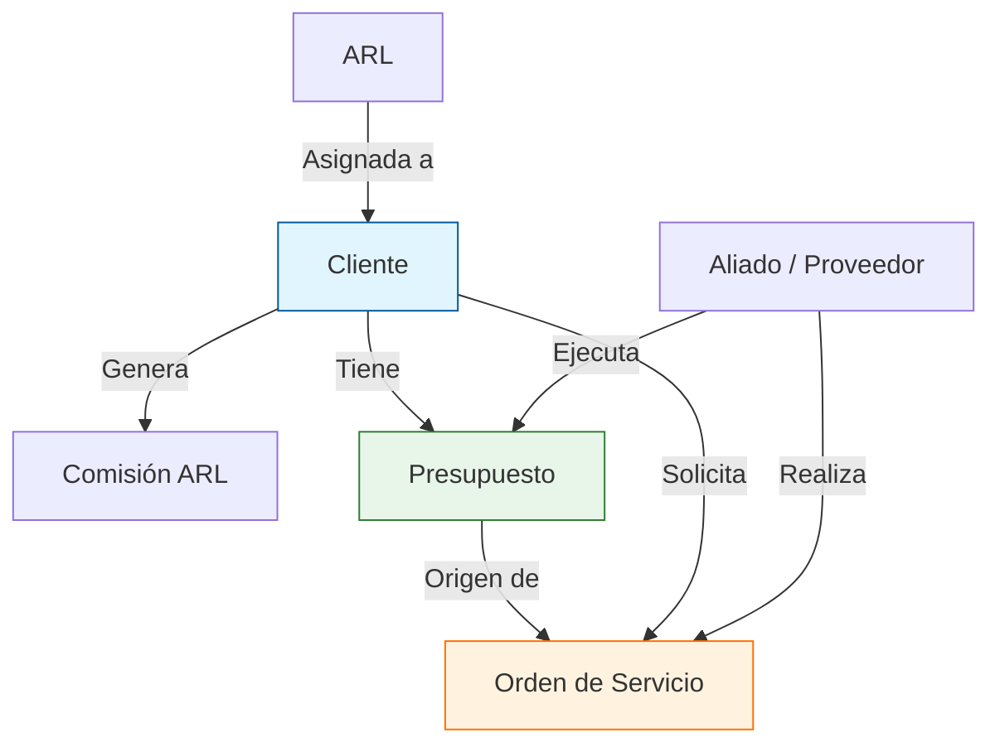

# 📘 Guía de Usuario - Sistema de Gestión Integral CIES

## Introducción
Bienvenido al Sistema de Gestión Integral CIES. Esta plataforma está diseñada para administrar de manera centralizada la operación de seguros, incluyendo la gestión de clientes, aliados estratégicos, comisiones de ARL, control presupuestal y ejecución de órdenes de servicio.

Esta guía tiene como objetivo explicar el funcionamiento del sistema módulo por módulo y aclarar cómo se relacionan los datos entre sí para garantizar la integridad de la información.

---

## 🏗️ Arquitectura de Información (Relación entre Tablas)

Para entender cómo funciona el sistema, es fundamental comprender cómo se conectan los datos. Piense en el sistema como una cadena donde cada eslabón depende del anterior.

### Diagrama de Relaciones
El siguiente diagrama ilustra cómo fluye la información dentro de CIES:

### Explicación de las Conexiones

1.  **Clientes y ARL**:
    *   Todo **Cliente** debe pertenecer a una **ARL**.
    *   Al crear un cliente, el sistema le pedirá seleccionar su ARL. Esto define las reglas de negocio para ese cliente.

2.  **Comisiones**:
    *   Las **Comisiones** se calculan base a los **Clientes**.
    *   NO se puede crear una comisión si el cliente no existe.
    *   El sistema toma el NIT del cliente para asociar todos los pagos y primas recibidas.

3.  **Presupuestos**:
    *   Un **Presupuesto** es la "bolsa de dinero" disponible para invertir en un **Cliente**.
    *   Puede estar asignado a un **Aliado** específico (quien ejecutará las actividades) o ser general.
    *   Al crear un presupuesto, usted está definiendo *cuánto* se puede gastar en actividades de prevención para ese cliente.

4.  **Órdenes de Servicio (OS)**:
    *   Es el documento final de ejecución. **Conecta todo**:
        *   Pertenece a un **Cliente** (¿para quién es el servicio?).
        *   La ejecuta un **Aliado** (¿quién hace el trabajo?).
        *   Descuenta dinero de un **Presupuesto** (¿de dónde sale la plata?).
    *   **Regla de Oro**: Para crear una Orden de Servicio, idealmente ya debe existir un Presupuesto aprobado, aunque el sistema permite creaciones directas si se configura así.

---

## 🚀 Manual de Uso por Módulo

### 1. Dashboard (Panel Principal)
*   **Función**: Vista general del estado de la empresa.
*   **Qué verá**:
    *   Gráficas de ejecución presupuestal.
    *   Alertas de órdenes de servicio pendientes.
    *   Resumen de comisiones del mes.

### 2. Módulo de Clientes
*   **Objetivo**: Registrar las empresas a las que CIES presta servicio.
*   **Pasos Clave**:
    1.  Clic en "Nuevo Cliente".
    2.  Diligenciar NIT, Razón Social y asignar la ARL.
    3.  Definir el `% de Comisión` pactado (dato vital para los cálculos automáticos).

### 3. Módulo de Aliados
*   **Objetivo**: Gestionar la base de datos de proveedores y profesionales externos.
*   **Pasos Clave**:
    1.  Registrar al aliado con su especialidad (Ej: Psicología, Ingeniería).
    2.  Configurar sus tarifas (Hora PBL o Especializada) para que las Órdenes de Servicio calculen los costos automáticamente.

### 4. Módulo de Comisiones
*   **Objetivo**: Controlar los ingresos por primas de seguros.
*   **Funcionamiento**:
    *   Aquí se registran los pagos que las ARL hacen a CIES.
    *   El sistema cruza estos pagos con el `% de Comisión` del Cliente para calcular cuánto dinero entra realmente.

### 5. Módulo de Presupuestos
*   **Objetivo**: Planificar la inversión en prevención.
*   **Flujo**:
    1.  Seleccione un Cliente.
    2.  Defina el monto a invertir (Ej: $10.000.000 del reintegro de la ARL).
    3.  Asigne qué Aliado ejecutará ese presupuesto (opcional).

### 6. Módulo de Órdenes de Servicio
*   **Objetivo**: Formalizar el trabajo a realizar.
*   **Importante**: Es el módulo operativo más crítico.
*   **Al crear una OS**:
    *   El sistema traerá automáticamente los datos del Cliente y del Aliado.
    *   Calculará el valor total (Horas x Costo Hora del Aliado).
    *   Al guardar, descontará automáticamente ese valor del saldo del Presupuesto asociado.

### 7. Usuarios y Permisos
*   **Roles Disponibles**:
    *   **ADMIN**: Ve y edita todo.
    *   **ANALISTA**: Operativo, crea órdenes y gestión de clientes.
    *   **CONSULTA**: Solo puede ver datos, no modificar.
    *   **CLIENTE**: Acceso limitado al "Portal Cliente" para ver solo sus propias órdenes y estado.

---

## ❓ Preguntas Frecuentes (FAQ)

**P: ¿Puedo borrar un Cliente que ya tiene Órdenes de Servicio?**
R: **No.** Por seguridad e integridad de datos, no puede eliminar un registro "padre" (Cliente) si tiene registros "hijos" (Órdenes, Presupuestos). Primero debe archivar o eliminar las órdenes asociadas.

**P: ¿Qué pasa si el Aliado cambia sus tarifas?**
R: Debe actualizar la tarifa en el módulo de Aliados. Las Órdenes de Servicio *nuevas* tomarán el nuevo precio; las *viejas* mantendrán el precio histórico con el que se crearon.

**P: ¿Por qué no veo algunos módulos?**
R: Depende de su Rol. Si es usuario de CONSULTA, no verá botones de "Crear" o "Guardar". Contacte al administrador si necesita más permisos.
